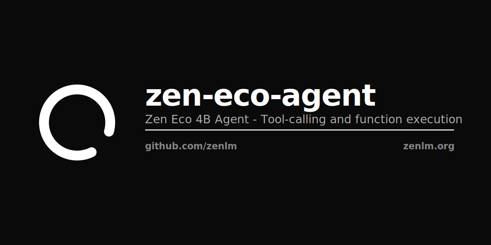

<p align="center"></p>

# Zen Eco 4B Agent

Tool-calling and function execution model. Part of the Zen Eco family.

[](https://opensource.org/licenses/Apache-2.0)

## Overview

Zen Eco 4B Agent is the agent variant of Zen Eco 4B with built-in tool-calling and function execution capabilities. Trained for structured tool use, JSON output, and multi-step agentic workflows.

| Property | Value |
|----------|-------|
| Parameters | 4B |
| Context | 32K |
| License | Apache 2.0 |

## Usage

```python
from transformers import AutoModelForCausalLM, AutoTokenizer

model = AutoModelForCausalLM.from_pretrained("zenlm/zen-eco-agent")
tokenizer = AutoTokenizer.from_pretrained("zenlm/zen-eco-agent")

tools = [
    {"type": "function", "function": {"name": "get_weather", "parameters": {"type": "object", "properties": {"location": {"type": "string"}}}}}
]

messages = [{"role": "user", "content": "What's the weather in Tokyo?"}]
inputs = tokenizer.apply_chat_template(messages, tools=tools, return_tensors="pt")
output = model.generate(inputs, max_new_tokens=256)
print(tokenizer.decode(output[0], skip_special_tokens=True))
```

## Related

- [zen-eco](https://huggingface.co/zenlm/zen-eco) — Base 4B model
- [zen-eco-instruct](https://huggingface.co/zenlm/zen-eco-instruct) — Instruction-tuned variant
- [zen-eco-thinking](https://huggingface.co/zenlm/zen-eco-thinking) — Chain-of-thought variant
- [Zen LM](https://github.com/zenlm) — Full model family

Apache 2.0 · [Zen LM](https://zenlm.org) · [Hanzo AI](https://hanzo.ai)
